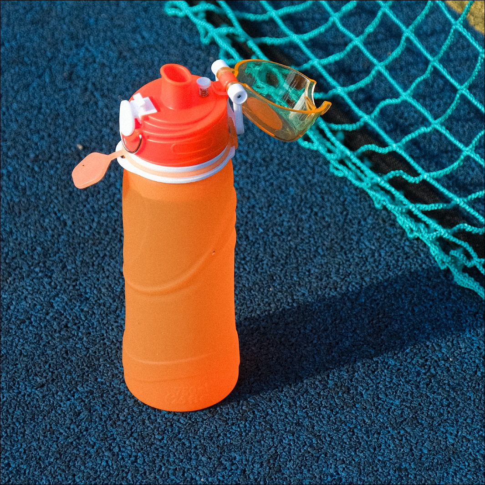
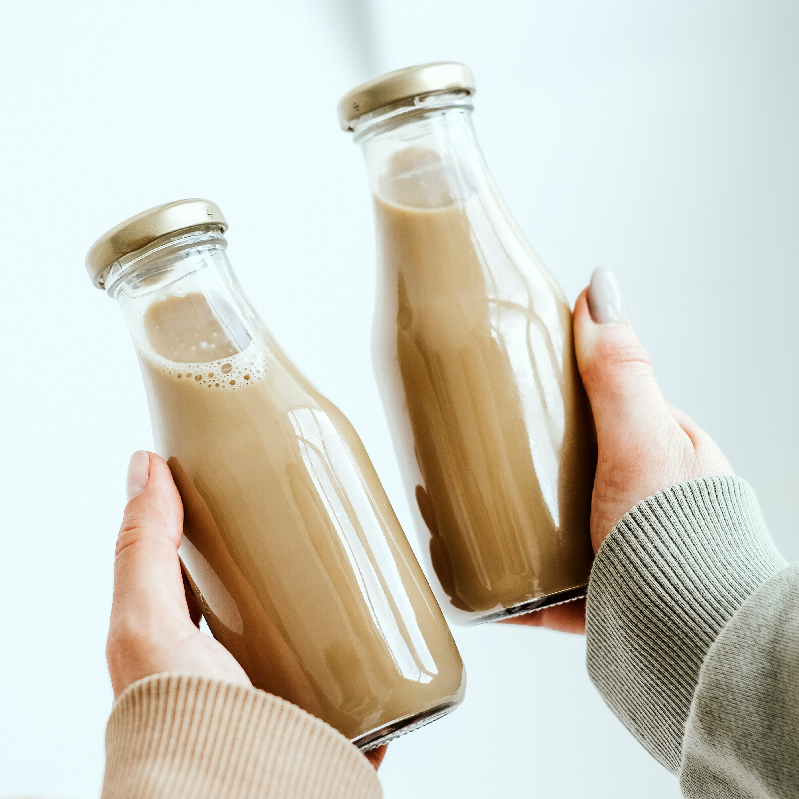

# khan_taylor_hw1
 
# QU3NCH!
# The Latest Craze in the Beverage Industry

#### And it's no surprise why!
This unique drink was created by a young entrepreneur named Sarah Smith, who saw a need for a more refreshing and hydrating option on the market

Sarah had always been an avid athlete and was always on the lookout for ways to improve her performance.

She quickly became frustrated with the lack of options available, and decided to take matters into her own hands. After months of research and experimentation, Sarah finally created the perfect formula for QU3NCH!

## What is QU3NCH!
[water poured into glasses](img/pouring_water.jpg)
The main ingredient in QU3NCH! is a special blend of electrolytes and vitamins that work together to help the body hydrate faster and more efficiently. This makes it the perfect drink for athletes, as well as anyone who is looking to stay hydrated throughout the day.

[QU3NCH! flavours; lemon and orange](img/juice.jpg)
One of the things that sets QU3NCH! apart from other sports drinks is its delicious taste. Sarah worked tirelessly to come up with a formula that was both refreshing and satisfying, and it shows in the final product. QU3NCH! comes in three delicious flavors - lemon, berry, and orange - all of which are sure to satisfy even the pickiest of palates.

## Who is QU3NCH! for?
[athlete drinking QU3NCH!](img/runner_drinking.jpg)
QU3NCH! has quickly become a popular choice among athletes, fitness enthusiasts, and health-conscious individuals all over the world. Its unique blend of electrolytes and vitamins has helped it stand out in a crowded market, and Sarah's commitment to sustainability has only added to its appeal.

[Gym-goer enjoying QU3NCH! between reps](img/gym.jpg)
But QU3NCH! isn't just for athletes. It's also a great option for people who are looking to improve their overall health and wellness. The electrolytes in QU3NCH! can help regulate blood pressure and support a healthy immune system, making it a valuable addition to anyone's diet.

[Zoom-in on player with soccer ball](img/soccer.jpg)
## So, what's next for QU3NCH! and its creator Sarah Smith?
sustainable, eco-friendly packaging
Sarah's passion for health and wellness extends beyond just the creation of QU3NCH!. She is also a strong advocate for sustainability and uses eco-friendly packaging for all of her products. This commitment to the environment sets QU3NCH! apart from other beverage companies and has helped it gain a loyal following.

[biker drinking QU3NCH!](img/biker_drinking.jpg)
With the success the company has seen so far, it's clear that the sky is the limit. Sarah is already working on new and innovative ways to improve the formula and make it even more accessible to people all over the world.

One thing is for sure - QU3NCH! is here to stay, and its creator Sarah Smith is sure to continue making waves in the beverage industry for years to come. If you're looking for a refreshing, hydrating, and sustainable drink option, look no further than QU3NCH!

[bugs-eyeview of stadium](img/stadium.jpg)
